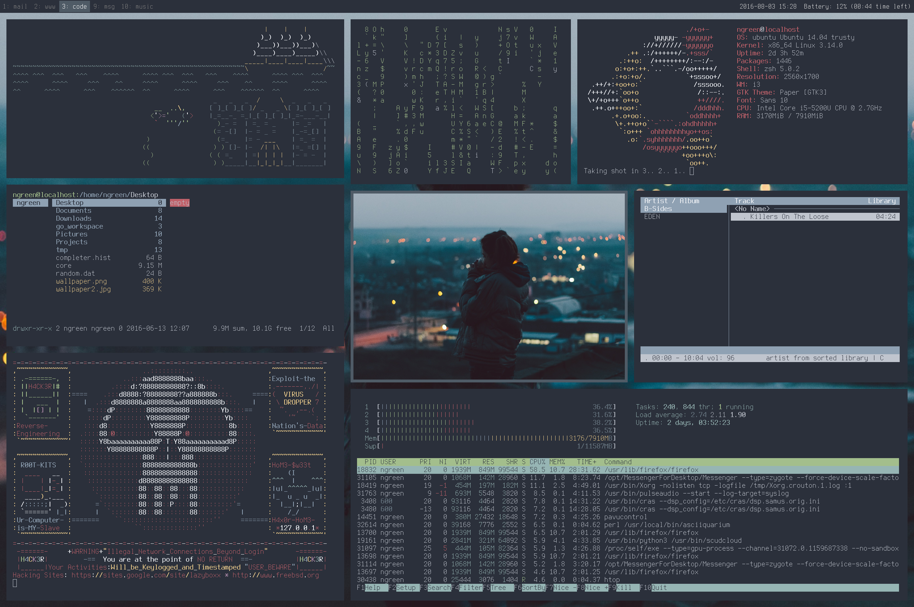

# Dotfiles

This is where my dotfiles are stored, as well as a list of useful
linux programs I use daily or fun scripts that I've found.

## About My Dots

- OS: Ubuntu 14.04
- Shell: zsh 5.0.2
- WM: i3-gaps
- Font: Terminus
- Terminal: urxvt

## Useful Programs

- [ScudCloud](https://github.com/raelgc/scudcloud): An open-source
  slack client for linux.
- [Firefox](https://www.mozilla.org/en-GB/firefox/new/): A free web browser by
  Mozilla.
- [Thunderbird](https://www.mozilla.org/en-GB/thunderbird/): Free email client
  by Mozilla.
- [Pavucontrol](https://apps.ubuntu.com/cat/applications/pavucontrol/): Volume
  control for PulseAudio.
- [GIMP](https://www.gimp.org/): Open-source cross-platform image editor.
- [Whatsie](https://whatsie.chat/): Cross-platform desktop client for WhatsApp Web.
- [Messenger for Desktop](https://messengerfordesktop.com/): Cross-platform
  desktop client for Facebook Messenger.
- [Filezilla](https://filezilla-project.org/): Open-source FTP solution.
- [Easytag](https://wiki.gnome.org/Apps/EasyTAG): Tag viewer and editor for
  music files.
- [Rofi](https://davedavenport.github.io/rofi/): A window switcher, run dialog
  and demenu replacement.
- [cmus](https://cmus.github.io/#home): A CLI-based music player for UNIX.
- [htop](http://hisham.hm/htop/): Interactive process viewer for UNIX.
- [ranger](http://ranger.nongnu.org/): Console file manager with VI key
  bindings.
- [feh](https://feh.finalrewind.org/): X11 image viewer aimed mostly at console
  users.

## Firefox Extensions

- Vimperator: Vim-inspired user interface on top of Firefox.
- RES: Reddit Enhancement Suite.
- Stylish: A firefox user styles manager.
- Tile Tabs: Tiles browser tabs horizontally or vertically in a grid.
- React Devtools: React debugging tools for Firefox.
- Pin/Unpin Tab: Provides shortcuts to quickly pin/unpin tabs.
- Markdown Viewer: Markdown document viewer.
- Custom New Tab: Load any URL for when a new tab is opened.
- Fireshot: Adds ability to take screenshots of entire web pages.
- Twily's Powerline Firefox User Style.

## Fun Scripts

- [cmatrix](http://www.asty.org/cmatrix/): Cool scrolling lines from the matrix
  in the terminal.
- [screenfetch](https://github.com/KittyKatt/screenFetch): Fetches terminal theme information.
- [3spooky](https://github.com/nathanielgreen/dotfiles/blob/master/funscripts/3spooky.lua): 
  Fun 'HACKERS' style ASCII skull in the terminal.
- [asciiquarium](https://github.com/cmatsuoka/asciiquarium): ASCII Aquarium in
  the terminal.

